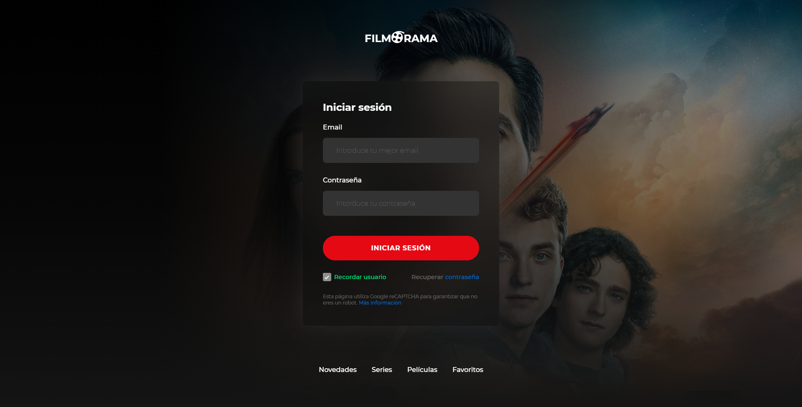
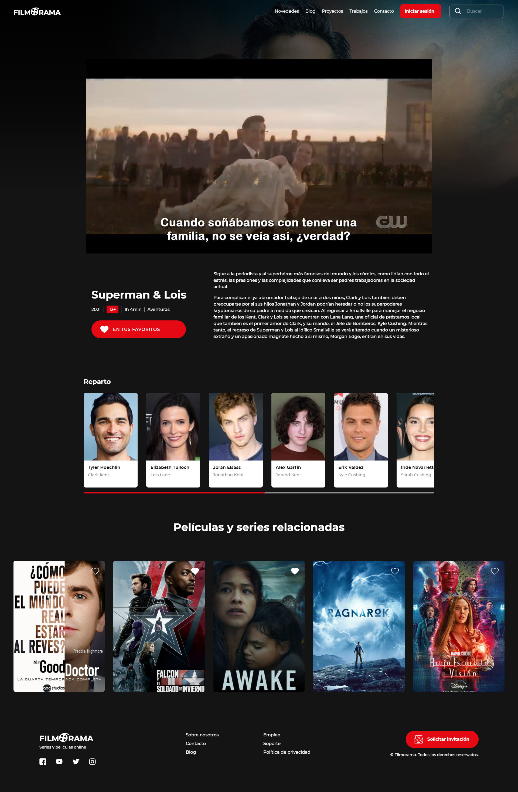
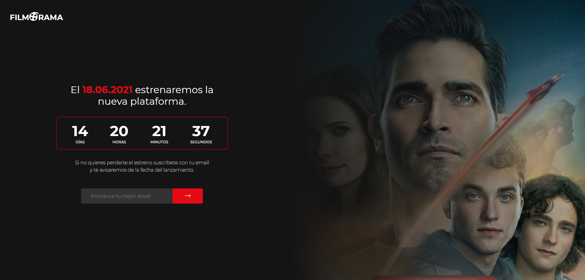
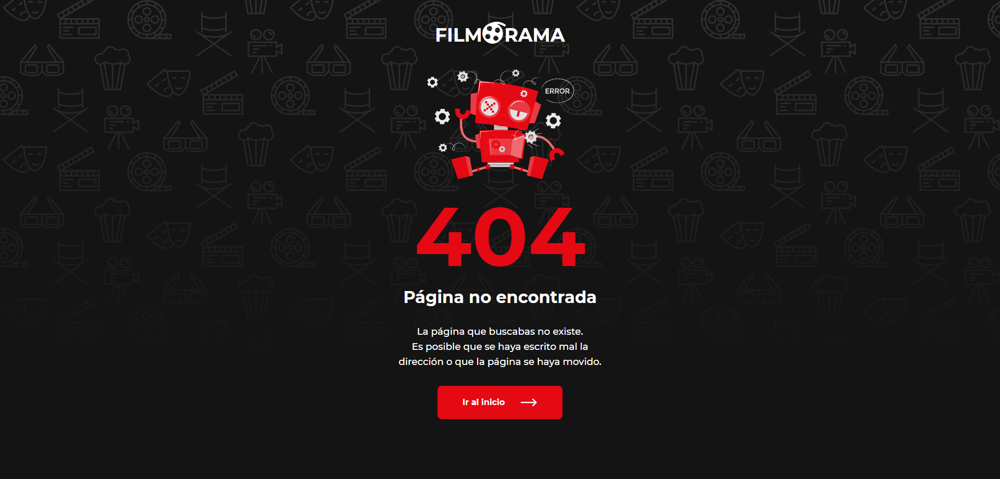
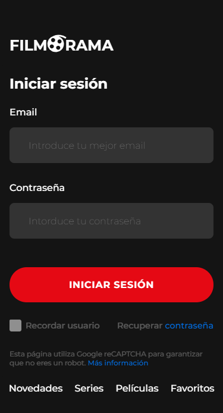
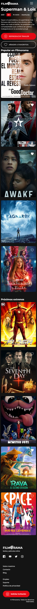

# Entrega_modulo_01_Git

Entrega de la práctica del módulo 02 Fundamentos web: html5 y css3

Autor: Pablo Pérez
Fecha: 11/07/2021

## Enunciado

La práctica se compone de la maquetación de las páginas de una plataforma de distribución de películas y series del estilo Netflix o HBO.

## Páginas desarrolladas

### Index o página de login (index.html)

### Pantalla principal (catalog.html)

### Pantalla de detalle película (product_details.html)

### Pantalla de coming soon (coming_soon.html)

### Pantalla de 404 (404.html)

## Estructura

En la realización de la práctica se a priorizado el uso de diferentes etiquetas, clases y técnicas para el posicionamiento y estilado de la información, por tanto carece de consistencia en muchos de los elementos del css planteados. En este sentido se ha procurado utilizar posicionamiento tradicional, posicionamiento con flex y con css grid.

## Recursos e imágenes

En cuanto a los recursos gráficos y textuales se ha utilizado la base de datos de series y películas themoviedb, por tanto todos los derechos de imágenes y textos descriptivos de las películas y series corresponden a dicha plataforma:

> https://www.themoviedb.org/?language=es

## Notas

Se debe atender que la práctica no es completamente funcional en cuanto a navegación y enlazado de elementos.
Por otro lado se ha procurado mantener la mejor experiencia en cada uno de los dispositivos.

